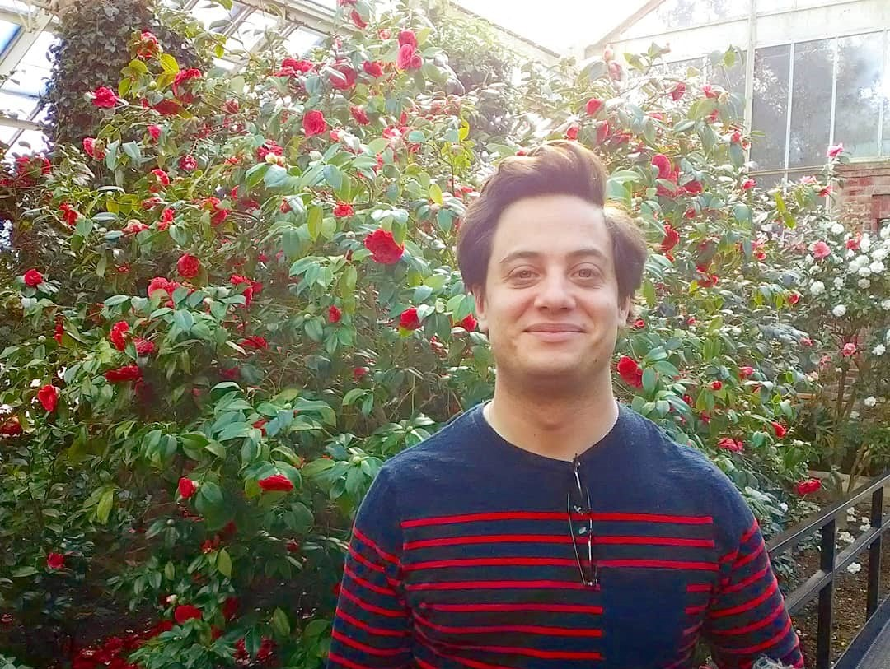
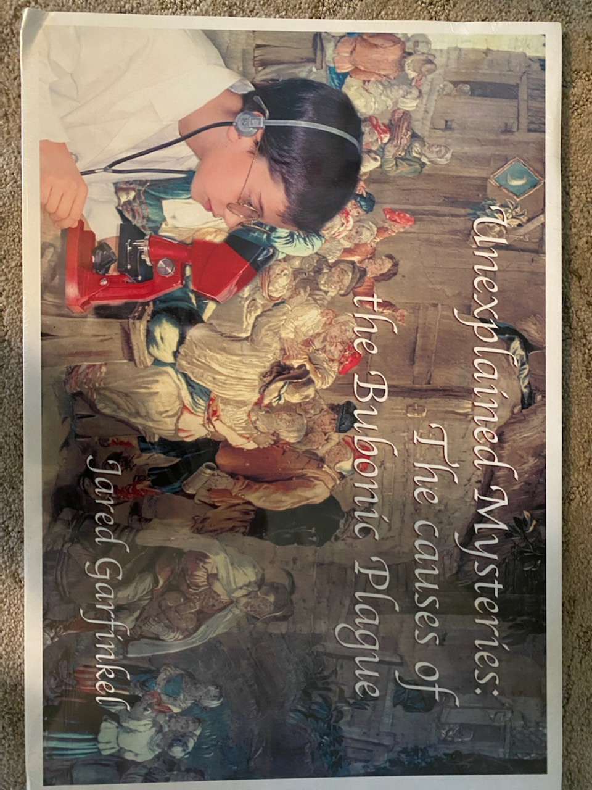
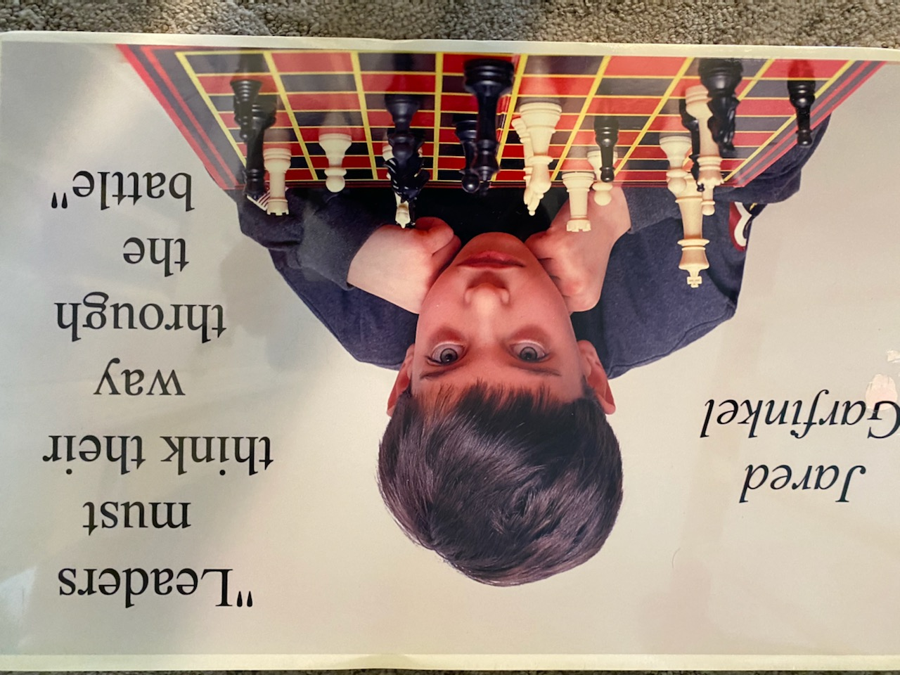
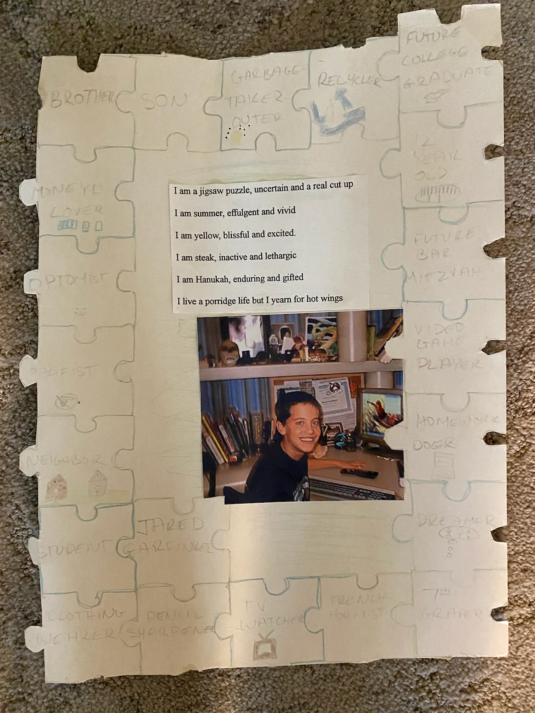

## This is Jared's awesome website

### My name is Jared and I make websites!!

### I have wanted to be a scientist for as long as I can remember

### I used to make up quotes

### I wrote this poem a while back

***

"When issues of significant moral value can be related to safety

they become widely accessible."

* Jared Garfinkel

## Bio

***

Jared Garfinkel recently received a Master of Science (M.S.) 

degree in Biostatistics from Columbia University and is currently

seeking a scientific role doing a public service in academia 

or the public sector. The work before Garfinkel is to challenge

the public to build the economy that cares for everyone.

***

Biostatistics bridges Garfinkel's appreciation for mathematics

and data collection with his life mission to end climate change and

stop racism. Throughout Garfinkel's academic and professional career,

the primary focus has been to prepare to decide to tackle these 

tough issues. Through public health solutions, Garfinkel wants to live 

in a world where children are free from environmental harm and 

one's zip code does not predict one's longevity and earning potential.

While climate change has and will continue to affect the work 

public health practitioners do, it was Garfinkel’s dedication to social 

equity that drove him back to public health. 

***

You can find my CV [here](jaredgarfinkel.html)
